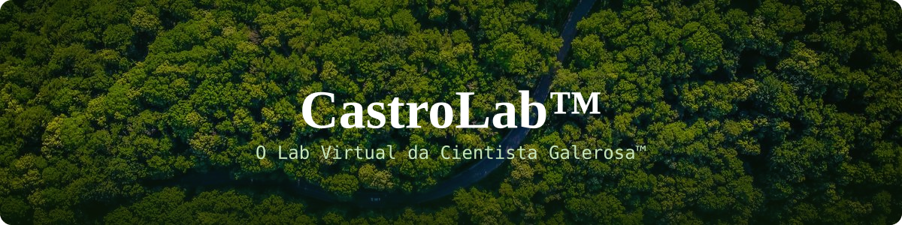
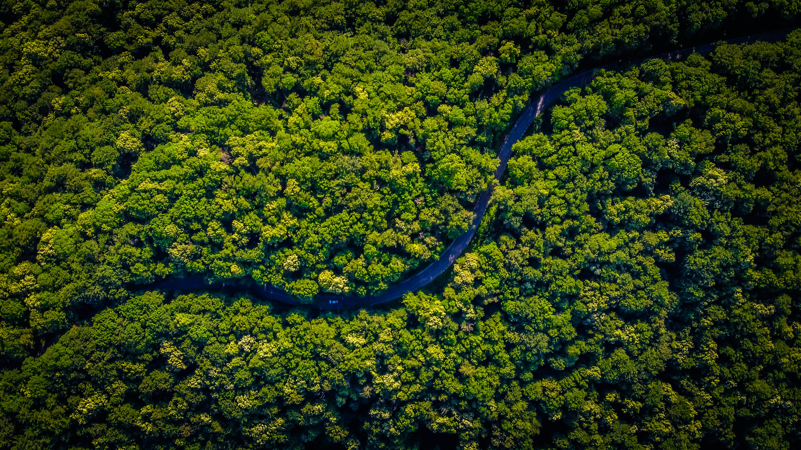
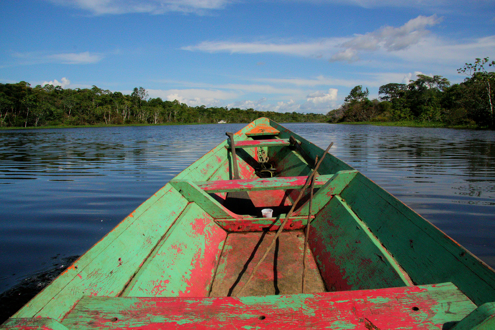
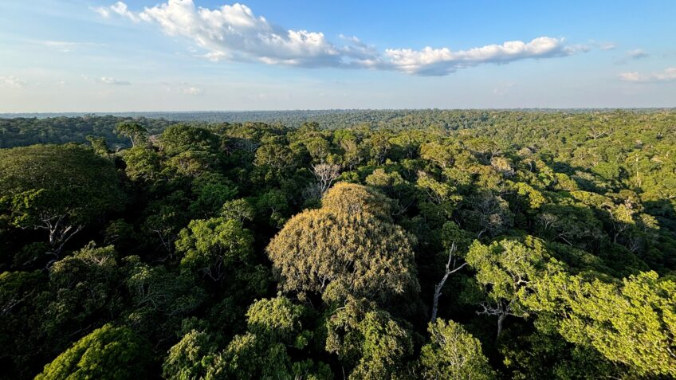
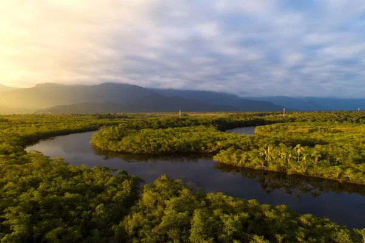
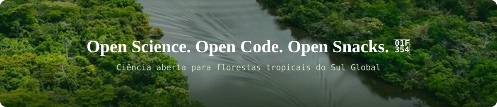

<div align="center">

<!-- Banner com foto real + texto embutido -->


<br/><br/>

</div>

> [!NOTE]
>
> 🌴 **Welcome to CastroLab™**
>
> We build open scientific infrastructure for Tropical Forests.
>
> If you're interested in Open Science, GeoAI, Remote Sensing, Environmental Sciences or Tropical Forest Ecology...
>
> **You're home.**

<div align="center">

<br/>

<!-- Texto com efeito de digitação -->
<a href="#">
  
</a>

# CastroLab™
### O Lab Virtual da Cientista Galerosa™

☕ **Não me leve a sério, me leve pra lanchar**


<!-- Contador de visitantes -->
<br/>


</div>

<h1> 👋 Oi! Eu sou a Sabrina.</h1>

Faço Doutorado em **Ciências do Ambiente e Sustentabilidade na Amazônia (PPGCASA/UFAM)**.

Minha pesquisa une:

🛰️ Sensoriamento Remoto&nbsp;&nbsp;·&nbsp;&nbsp;🤖 GeoAI&nbsp;&nbsp;·&nbsp;&nbsp;🌳 Ecologia de Florestas Tropicais&nbsp;&nbsp;·&nbsp;&nbsp;🌎 Ciência Aberta&nbsp;&nbsp;·&nbsp;&nbsp;🌱 Governança Socioambiental

Tudo isso para responder perguntas difíceis sobre as florestas tropicais. Perguntas do tipo:

> **O que a floresta guarda?**
> **O que as comunidades percebem?**
> **Quando essas duas histórias deixam de conversar?**

Foi daí que nasceu o primeiro projeto do **CastroLab™: BIODATUM**.

<h1> 🚀 O que eu construo</h1>

Não gosto de escrever código que morre junto com a tese. Prefiro construir ferramentas que outras pessoas possam usar.

Minha ideia é simples:

> **Se alguém conseguir fazer boa ciência usando um pacote que eu desenvolvi, então ele cumpriu seu papel.**

<h1> 🌴 Projetos</h1>

<table>
<tr>
<td width="33%" valign="top" align="center">

### 🛰️ BIODATUM
[](https://github.com/scasttro7/Biodatum)

Framework científico para monitoramento socioecológico de florestas tropicais.

🌳 Resiliência Florestal
👥 Percepção Comunitária
🏛️ Governança Territorial
🌎 Inteligência Climática

</td>
<td width="33%" valign="top" align="center">

### 🌳 ForestR
[](https://github.com/scasttro7/ForestR)

Pacote R para biomassa, carbono e equações alométricas de florestas tropicais.

🌎 Amazônia
🌐 Pantropical
🌍 Bacia do Congo
🌏 Sudeste Asiático

</td>
<td width="33%" valign="top" align="center">

### 🇧🇷 EcoBiomasBR
[](https://github.com/scasttro7/EcoBiomasBR)

Pacote R para análise integrada dos seis biomas brasileiros.

🌱 Biomassa
🔥 Carbono
☔ Clima
🛰️ Sensoriamento remoto

</td>
</tr>
</table>

<table>
<tr>
<td width="100%" valign="top" align="center">

### 🎮 Amazônia Explorer
[](https://scasttro7.github.io/amazonia-explorer/)
[](https://github.com/scasttro7/amazonia-explorer)

Protótipo de jogo educativo estilo Pokémon/Zelda — explore uma RDS fictícia da Amazônia e descubra espécies reais (com nome científico e status de conservação) andando pelo mapa.

🐒 Sauim-de-coleira
🦅 Harpia
🌺 Vitória-régia
🐬 Boto-cor-de-rosa
🌳 Castanheira

</td>
</tr>
<table>
<tr>
<td width="100%" valign="top" align="center">

### 🎮 Guardiões do Resíduo — IPEB
[](https://scasttro7.github.io/Guardi-es-do-Res-duo/)
[](https://github.com/scasttro7/Guardi-es-do-Res-duo)
[](https://doi.org/10.5281/zenodo.21910686)

Jogo interativo de gestão territorial sobre transição energética e descarbonização — protótipo de comunicação científica para o Índice de Potencial Energético de Biomassa Residual (IPEB), testado nos cenários Brasil e Bolívia como prova de conceito de replicabilidade regional no MERCOSUL.

⚡ Transição Energética · 🌳 Biomassa Residual · 🎮 Ciência Interativa · 🇧🇷 Brasil · 🇧🇴 Bolívia · 🏆 19º Prêmio MERCOSUL 2026

</td>
</tr>
</table>

<h1> 🌎 Agenda científica</h1>

Hoje trabalho principalmente com:


Mas minha agenda científica pretende conectar diferentes florestas tropicais. Próximos estudos:

<p>


</p>

Porque problemas parecidos merecem conversar entre si.


# 🛠️ Tecnologias

<p align="center">

&nbsp;&nbsp;

&nbsp;&nbsp;

</p>


# 📊 GitHub Stats

<p align="center">


</p>

<p align="center">

</p>

<p align="center">

</p>


# 🌳 Contribuições (modo floresta)

<p align="center">
  
</p>

# 🐍 Contribuições (modo cobrinha)

<p align="center">
  
</p>


# 🌱 Ciência que acredito

🌎 Ciência Aberta&nbsp;&nbsp;·&nbsp;&nbsp;💻 Código Aberto&nbsp;&nbsp;·&nbsp;&nbsp;📊 Dados Abertos&nbsp;&nbsp;·&nbsp;&nbsp;🤝 Colaboração&nbsp;&nbsp;·&nbsp;&nbsp;🍔 Lanches


# 📚 Curiosidades cientificamente relevantes

🥤 Sommelier Internacional de Toddynho.


# 🤝 Bora trocar ideia?

Se você trabalha com:

`Remote Sensing` · `GeoAI` · `Tropical Forest Ecology` · `Environmental Sciences` · `Open Science` · `Tropical Forests`

...vamos conversar! Sempre há espaço para novas colaborações.

*(E provavelmente também para um Açaí.)*


# 🗺️ Roadmap

Não é uma promessa de prazo — é a direção que o CastroLab™ está tomando.

```
🌴 CastroLab™
│
├── 🔬 Research        BIODATUM · artigos · protocolos · cooperação internacional
├── 📦 Software         ForestR · EcoBiomasBR · ForestGrid
├── 🎮 Games            Amazônia Explorer · TucuxiDéx
├── 📚 Learning         tutoriais · workshops · ciência aberta
├── 🌍 Open Data         datasets · scripts · APIs · reprodutibilidade
└── 🤝 Community         ciência cidadã · comunidades tradicionais · extensão
```

Hoje o centro de gravidade é o **Research** (a tese, sempre). Os outros braços crescem como side-quests — pequenos, aos poucos, sem pressa.

<p align="center">


</p>

<br/>

<div align="center">



*"A melhor ciência é aquela que outras pessoas conseguem usar."*

</div>
